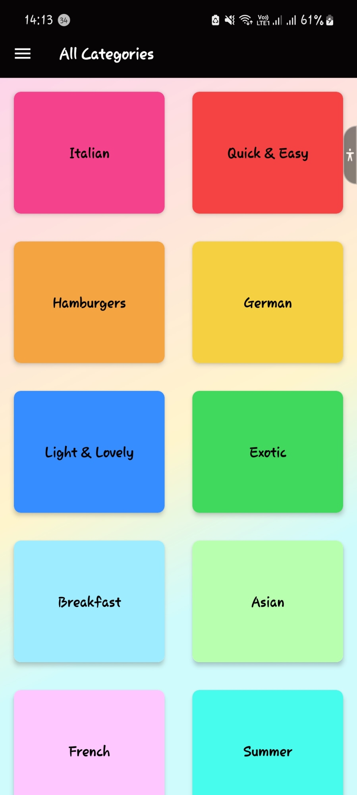
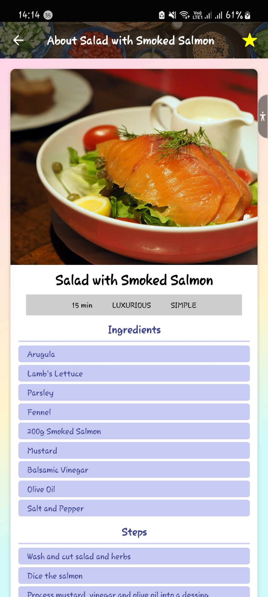

## CHOW - Quick Recipe Meals App

[Android build link](https://expo.dev/accounts/marvinespira/projects/myRecipeMaestro/builds/3149369e-f036-4bc5-91b8-663461ba55a1)

[Ios build link](https://expo.dev/artifacts/eas/3XPfMirNXL2pKx863yYyBV.tar.gz)

### Technologies Used

#### \* React Native

#### \* Redux

<table>
<tr>
<th> Home Screen</th>
<th> Drawer Navigation Screen </th>
</tr>
<tr>
<td>

</td>
<td>

</td>
</tr>
</table>

<table>
<tr>
<th> Meals List Screen </th>
<th> Meal Details Screen </th>
</tr>
<tr>
<td>

</td>
<td>

</td>
</tr>
</table>

<table>
<tr>
<th> Favorite Meals Screen </th>
</tr>
<tr>
<td>

</td>
</tr>
</table>

